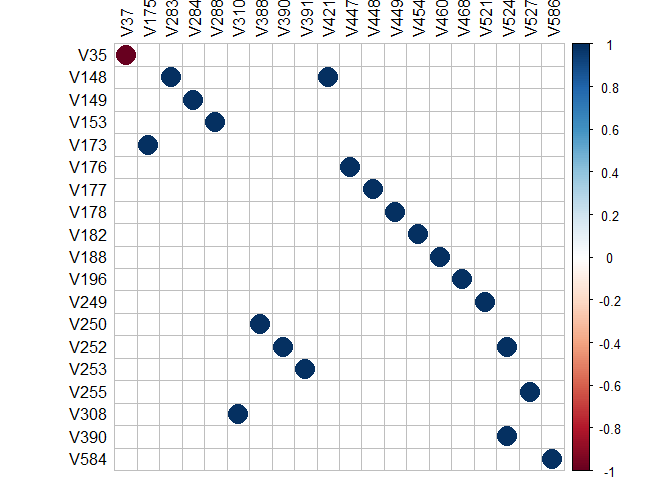

A Real Data Application of SREWMA Control Chart
================
Jorge Merlo
6/5/2021

# Problem Statement

In any industry, quality of a process is determined by their capacity to
generate products/services that met the requirements established by the
consumers. To meet these specifications multivariate statistical process
control (MSPC), through control charts, evaluates a multivariate process
quality by monitoring its underlying distribution in real-time, the
purpose of this is to detect as soon as possible any potential mean or
scale shift attributed to special causes.

Although the traditional Hotelling’s *T*<sup>2</sup> is the most common
control chart in MSPC, it is built under the assumption that process
follows a multivariate normal distribution. Nevertheless, it is well
known that in practice this assumption is rarely fulfilled because of
the process often following an unknown distribution.

Therefore, multivariate nonparametric approaches such as the Signed Rank
Exponentially Weighted Average (SREWMA) control chart **(cita)** can be
considered as an efficient alternative that allows the monitoring of
processes for which no known distribution is assumed. In this document
we discuss the implementation of SREWMA Control Chart to an important
process monitoring problem in a semiconductor manufacturing industry.
The dataset is available from the UC Irvine Machine Learning Repository
(<http://archive.ics.uci.edu/ml/machine-learning-databases/secom/secom.names>).

# Data Cleaning

In order to make a simple reproduction of the following analysis,
instead of working with data that comes from a local .csv file we
directly download the data from the url and load it into the
environment:

``` r
download.file("http://archive.ics.uci.edu/ml/machine-learning-databases/secom/secom.data", destfile = "secom.data") # explanatory variables

download.file("http://archive.ics.uci.edu/ml/machine-learning-databases/secom/secom_labels.data", destfile  = "secom_labels.data") # output

secom <- read.table("secom.data")
secom_lab <- read.table("secom_labels.data")[,1]
secom <- cbind(secom,secom_lab) # concatenation of variables
```

There are originally 1567 observations and 591 variables, but the
dataset contains many missing values. Therefore, we process and clean
the data before using it in our illustration. We remove the variables
having 5 or more missing values:

``` r
col.na <- sapply(secom, function(x) sum(is.na(x))) # counting the number of NA's in each variable
# sum(col.na >= 5) # detecting how many columns contain more than 5 missing values
secom <- secom[, which(col.na < 5)] # filtering of data based on the previous condition
```

There are 278 remaining variables. Now, this data set has some missing
observations, as variables with less than 5 missing observations are
retained. Observations with missing values are ommited and finally, we
remove the variables with constant value.

``` r
row.na <- rowSums(is.na(secom)) # detecting observations with missing values
secom <- secom[which(row.na==0), ] # filtering data based on previous condition
secom.fdf <- secom[ ,apply(secom, 2, var) != 0] # final data frame to be analyzed (variables with constant value are removed)
secom_ex <- secom.fdf[which(secom.fdf$secom_lab==-1), ] # in control dataset to be explored
```

After data cleaning, there are 1549 observations and 248 variables. It
is known from the data source that out of the 1544 observations
available after cleaning, in 1447 cases the item passes the quality test
whereas it fails in remaining 102 cases. Therefore, we consider the 1447
observations as our reference sample.

# Exploratory Analysis

It is desirable to set up an on-line detection system to monitor the
production process of the secom manufacturing process to guarantee its
quality. The sample correlation matrix of this data contains several
large entries, which demonstrates that the variables have considerable
interrelationships and consequently a multivariate control chart is
likely to be more appropriate than a univariate control chart. The plot
below illustrates the pairwise variables that have a correlation greater
than 0.999.

``` r
source("corr_simple.R")
corr_simple(secom_ex, sig = 0.999)
```

    ## Warning: package 'corrplot' was built under R version 4.0.5

    ## corrplot 0.84 loaded

    ## Warning in cor(df_cor): the standard deviation is zero

    ##       Var1 Var2       Freq
    ## 6421   V35  V37 -1.0000000
    ## 20994 V173 V175  0.9999998
    ## 34332 V308 V310  0.9999994
    ## 29587 V153 V288  0.9999973
    ## 40455 V253 V391  0.9999921
    ## 40208 V252 V390  0.9999434
    ## 39714 V250 V388  0.9999234
    ## 59279 V584 V586  0.9999001
    ## 48058 V177 V448  0.9998978
    ## 53546 V390 V524  0.9998584
    ## 53492 V252 V524  0.9998411
    ## 52751 V249 V521  0.9997644
    ## 28599 V148 V283  0.9996264
    ## 28846 V149 V284  0.9995583
    ## 50034 V188 V460  0.9995488
    ## 48305 V178 V449  0.9995129
    ## 47811 V176 V447  0.9994779
    ## 41883 V148 V421  0.9993477
    ## 53986 V255 V527  0.9992080
    ## 50528 V196 V468  0.9991716
    ## 48799 V182 V454  0.9991206

<!-- -->

Plots below show the scatter plots of three randomly selected variables.
The joint distribution of each pair of variables are far from bivariate
normal. The normal Q-Q plots for these three distributions are also
shown, which clearly indicate that the marginals are not normal either:

``` r
set.seed(123)
secom_test <- secom_ex[, -ncol(secom_ex)]
secom_test <- secom_test[, sample(ncol(secom_ex), 3)]

par(mfrow = c(2,3))
w <- combn(3,2)
nam <- colnames(secom_test)

for (i in 1:6) {
  
  if (i <= 3){
    plot(secom_test[,w[1,i]], secom_test[,w[2,i]], pch = 16, xlab = nam[w[1,i]], 
         ylab = nam[w[2,i]], cex.lab = 1.5, cex.axis = 1.5)
  } else {
    qqnorm(secom_test[,(i-3)], ylab = sprintf("%s Sample Quantiles", 
                                             ylab = nam[w[2,(i-3)]]), 
           cex.lab = 1.5, cex.axis = 1.5)
    qqline(secom_test[,(i-3)], col = "red")
  }
  
}
```

<!-- -->

We also run the Shapiro-Wilk goodness-of-fit test for normality and the
Mardia’s multivariate normality test:

``` r
library(MVN)
```

    ## Registered S3 method overwritten by 'GGally':
    ##   method from   
    ##   +.gg   ggplot2

    ## sROC 0.1-2 loaded

``` r
mvn(secom_test)
```

    ## $multivariateNormality
    ##              Test        Statistic p value Result
    ## 1 Mardia Skewness 16944.2142435055       0     NO
    ## 2 Mardia Kurtosis 354.725571676656       0     NO
    ## 3             MVN             <NA>    <NA>     NO
    ## 
    ## $univariateNormality
    ##           Test  Variable Statistic   p value Normality
    ## 1 Shapiro-Wilk   V377       0.8700  <0.001      NO    
    ## 2 Shapiro-Wilk   V491       0.9580  <0.001      NO    
    ## 3 Shapiro-Wilk   V431       0.3251  <0.001      NO    
    ## 
    ## $Descriptives
    ##         n         Mean      Std.Dev  Median     Min      Max     25th     75th
    ## V377 1447  0.001595992 5.283896e-04  0.0016  0.0004   0.0082  0.00130  0.00190
    ## V491 1447 51.402471527 1.805835e+01 48.4924 13.7225 142.8436 38.56920 61.70265
    ## V431 1447 17.273799585 3.114764e+01 10.9684  0.0000 400.0000  6.92585 17.34045
    ##           Skew  Kurtosis
    ## V377 2.5836973 23.577787
    ## V491 0.9057055  1.361428
    ## V431 7.8994888 76.704842

All these tests together with the plots shown above suggest that the
multivariate normality assumption is invalid and thus we could expect
the nonparametric chart to be more robust and powerful than normal-based
approaches for this dataset.

# SREWMA Control Chart Implementation
