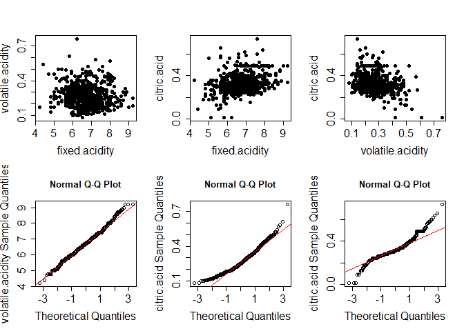

A Real Data Application of SREWMA Control Chart
================
Jorge Merlo
6/5/2021

## Problem Statement

In any industry, quality of a process is determined by their capacity to
generate products/services that met the requirements established by the
consumers. To meet these specifications multivariate statistical process
control (MSPC), through control charts, evaluates a multivariate process
quality by monitoring its underlying distribution in real-time, the
purpose of this is to detect as soon as possible any potential mean or
scale shift attributed to special causes.

Although the traditional Hotelling’s *T*<sup>2</sup> is the most common
control chart in MSPC, it is built under the assumption that process
follows a multivariate normal distribution. Nevertheless, it is well
known that in practice this assumption is rarely fulfilled because of
the process often following an unknown distribution.

Therefore, multivariate nonparametric approaches such as the Signed Rank
Exponentially Weighted Average (SREWMA) control chart Zou et al. (2012)
can be considered as an efficient alternative, since allows us to
monitor the mean of a multivariate processes for which no known
distribution is assumed.

In this document we reproduce the SREWMA control chart, this has been
one of the most referenced works in nonparametric MSPC since is a
pioneering proposal that can start monitoring with a little amount of
historical observations. A ready-to-use function is provided and if
necessary, it can be easily adapted to the needs of the practitioner. We
discuss its implementation to a real dataset from a white wine
production process. The data set contains a total of 4898 observations,
and is publicly available in the UC Irvine Machine Learning Repository
(<http://archive.ics.uci.edu/ml/machine-learning-databases/wine-quality>).

## Exploratory Analysis

In order to make a simple reproduction of the following analysis,
instead of working with data that comes from a local .csv file we
directly download the data from the url and load it into the
environment:

``` r
download.file("http://archive.ics.uci.edu/ml/machine-learning-databases/wine-quality/winequality-white.csv", destfile = "wq_data.csv") # explanatory variables

D <- read.csv("wq_data.csv", sep = ";")

head(D)
```

    ##   fixed.acidity volatile.acidity citric.acid residual.sugar chlorides
    ## 1           7.0             0.27        0.36           20.7     0.045
    ## 2           6.3             0.30        0.34            1.6     0.049
    ## 3           8.1             0.28        0.40            6.9     0.050
    ## 4           7.2             0.23        0.32            8.5     0.058
    ## 5           7.2             0.23        0.32            8.5     0.058
    ## 6           8.1             0.28        0.40            6.9     0.050
    ##   free.sulfur.dioxide total.sulfur.dioxide density   pH sulphates alcohol
    ## 1                  45                  170  1.0010 3.00      0.45     8.8
    ## 2                  14                  132  0.9940 3.30      0.49     9.5
    ## 3                  30                   97  0.9951 3.26      0.44    10.1
    ## 4                  47                  186  0.9956 3.19      0.40     9.9
    ## 5                  47                  186  0.9956 3.19      0.40     9.9
    ## 6                  30                   97  0.9951 3.26      0.44    10.1
    ##   quality
    ## 1       6
    ## 2       6
    ## 3       6
    ## 4       6
    ## 5       6
    ## 6       6

The data were recorded by a computerized system, which automatically
manages the process of wine sample testing from producer requests to
laboratory and sensory analysis. For each observation, there are eleven
continuous measurements (based on physicochemical tests) including fixed
acidity, volatile acidity, citric acid, residual sugar, chlorides, free
sulfur dioxide, total sulfur dioxide, density, pH, sulphates, and
alcohol (denoted by
*x*<sub>1</sub>, *x*<sub>2</sub>, ..., *x*<sub>11</sub>, respectively).
A categorical variable, quality, indicating the wine quality between 0
(very bad) and 10 (excellent) is also provided based on sensory
analysis. The goal of this data analysis is mainly to model and monitor
wine quality based on physicochemical tests, more detailed discussion
about this dataset is given by Cortez et al. (2009) and the references
therein.

Under the SPC context of sequentially monitoring the wine production
process, we assume that the in control and out of control observations
and are those whose standard quality level is 7 (LV7; as also suggested
by Cortez et al. (2009)) and 6 respectively. The sample correlation
matrix of this data (shown below) contains several large entries, which
demonstrates that the variables have considerable interrelationships and
consequently a multivariate control chart is likely to be more
appropriate than a univariate control chart.

``` r
library("corrplot")
```

    ## Warning: package 'corrplot' was built under R version 4.0.5

    ## corrplot 0.84 loaded

``` r
dic = D[which(D[,ncol(D)] == 7),(1:(ncol(D)-1))] # In control data
cor.dic = cor(dic)
corrplot(cor.dic)
```

<!-- -->

Plots below show the scatter plots of three randomly selected variables.
The joint distribution of each pair of variables are far from bivariate
normal. The normal Q-Q plots for these three distributions are also
shown, which clearly indicate that the marginals are not normal either:

``` r
set.seed(123)

par(mfrow = c(2,3))
w <- combn(3,2)
nam <- colnames(dic)

for (i in 1:6) {
  
  if (i <= 3){
    plot(dic[,w[1,i]], dic[,w[2,i]], pch = 16, xlab = nam[w[1,i]], 
         ylab = nam[w[2,i]], cex.lab = 1.5, cex.axis = 1.5)
  } else {
    qqnorm(dic[,(i-3)], ylab = sprintf("%s Sample Quantiles", 
                                             ylab = nam[w[2,(i-3)]]), 
           cex.lab = 1.5, cex.axis = 1.5)
    qqline(dic[,(i-3)], col = "red")
  }
  
}
```

<!-- -->

We also run the Shapiro-Wilk goodness-of-fit test for normality and the
Mardia’s multivariate normality test:

``` r
library(MVN)
```

    ## Registered S3 method overwritten by 'GGally':
    ##   method from   
    ##   +.gg   ggplot2

    ## sROC 0.1-2 loaded

``` r
mvn(dic)
```

    ## $multivariateNormality
    ##              Test        Statistic p value Result
    ## 1 Mardia Skewness 3310.06094111141       0     NO
    ## 2 Mardia Kurtosis 37.3370551116743       0     NO
    ## 3             MVN             <NA>    <NA>     NO
    ## 
    ## $univariateNormality
    ##            Test             Variable Statistic   p value Normality
    ## 1  Shapiro-Wilk    fixed.acidity        0.9940  0.0014      NO    
    ## 2  Shapiro-Wilk   volatile.acidity      0.9600  <0.001      NO    
    ## 3  Shapiro-Wilk     citric.acid         0.9332  <0.001      NO    
    ## 4  Shapiro-Wilk    residual.sugar       0.8415  <0.001      NO    
    ## 5  Shapiro-Wilk      chlorides          0.8961  <0.001      NO    
    ## 6  Shapiro-Wilk free.sulfur.dioxide     0.9679  <0.001      NO    
    ## 7  Shapiro-Wilk total.sulfur.dioxide    0.9828  <0.001      NO    
    ## 8  Shapiro-Wilk       density           0.9165  <0.001      NO    
    ## 9  Shapiro-Wilk          pH             0.9913  <0.001      NO    
    ## 10 Shapiro-Wilk      sulphates          0.9492  <0.001      NO    
    ## 11 Shapiro-Wilk       alcohol           0.9770  <0.001      NO    
    ## 
    ## $Descriptives
    ##                        n         Mean     Std.Dev    Median      Min      Max
    ## fixed.acidity        880   6.73471591  0.75567021   6.70000  4.20000   9.2000
    ## volatile.acidity     880   0.26276705  0.09110644   0.25000  0.08000   0.7600
    ## citric.acid          880   0.32562500  0.07918280   0.31000  0.01000   0.7400
    ## residual.sugar       880   5.18647727  4.29798867   3.65000  0.90000  19.2500
    ## chlorides            880   0.03819091  0.01069741   0.03700  0.01200   0.1350
    ## free.sulfur.dioxide  880  34.12556818 13.24473728  33.00000  5.00000 108.0000
    ## total.sulfur.dioxide 880 125.11477273 32.74298174 122.00000 34.00000 229.0000
    ## density              880   0.99245240  0.00276767   0.99176  0.98711   1.0004
    ## pH                   880   3.21389773  0.15840190   3.20000  2.84000   3.8200
    ## sulphates            880   0.50310227  0.13019470   0.48000  0.22000   1.0800
    ## alcohol              880  11.36793561  1.24653581  11.40000  8.60000  14.2000
    ##                           25th     75th       Skew   Kurtosis
    ## fixed.acidity          6.20000   7.2000  0.1400228  0.4158163
    ## volatile.acidity       0.19000   0.3200  0.8086661  0.9838638
    ## citric.acid            0.28000   0.3600  0.7500459  2.8378470
    ## residual.sugar         1.70000   7.3250  1.1296764  0.2360288
    ## chlorides              0.03100   0.0440  1.9888534 13.6109278
    ## free.sulfur.dioxide   25.00000  41.0000  0.8033747  1.7114799
    ## total.sulfur.dioxide 101.00000 144.2500  0.5003653  0.2730502
    ## density                0.99058   0.9937  0.9774719  0.3328631
    ## pH                     3.10000   3.3200  0.2691480 -0.1335446
    ## sulphates              0.41000   0.5800  0.9507815  1.1973687
    ## alcohol               10.60000  12.3000 -0.3046560 -0.5622180

All these tests together with the plots shown above suggest that the
multivariate normality assumption is invalid and thus we could expect
the nonparametric chart to be more robust and powerful than normal-based
approaches for this dataset.

## SREWMA Control Chart Implementation

In order to implement the SREWMA control chart lets assume that we have
only *m* = 20 historical observations from LV7 and initially monitored
30 observations from LV7 and then obtained the LV6 observations
sequentially. The location parameter is of the greatest interest and
thus we construct the SREWMA control charts to monitor the wine quality.
We set the control limit *h* = 22.918 (solid horizontal line) to obtain
a false alarm every 500 in control monitoring points (see Qiu (2014) for
a detailed discussion on the performance of a control chart), the values
of *λ* are chosen to be 0.025 for the SREWMA to ensure their IC
robustness to this non-normal data, Zou et al. (2012) provides tables
with *h* and *λ* parameters corresponding to other specific scenarios.

``` r
library(SpatialNP)
library(depth.plot)
```

    ## 
    ## Attaching package: 'depth.plot'

    ## The following object is masked from 'package:SpatialNP':
    ## 
    ##     spatial.rank

``` r
set.seed(123)

m <- 20 # number of historical observations considered in control
nic <- 30 # number of observations to be monitored that are considered in control
noc <- 50 # number of observations to be monitored that are considered out of control
lambda <- 0.025 # lambda value

p <- ncol(dic) # number of dimensions

r.ic = sample(1:nrow(dic), (m+nic))

xr = dic[r.ic[1:m], ] # randomly selection for historical observations
xr <- as.matrix(xr)

xic = dic[r.ic[(m+1):(m+nic)], ] # randomly selection for historical observations
xoc = D[which(D[,ncol(D)] == 6),(1:(ncol(D)-1))] # in control observations
xoc = xoc[sample(1:nrow(xoc), noc),] # out of control observations

xi <- rbind(xic, xoc) # concatenation of monitoring points
xi <- as.matrix(xi)

ni <- nic + noc

S0 <- cov(xr)

M0 <- chol(solve(S0))
xrt <- as.matrix(xr)%*%M0

sr_m0 <- SpatialNP::spatial.rank(xrt, shape = F) # estimation of spatial ranks 
                                                 # for historical observations

# Parameters to estimate the monitoring statistics
sr_m0_2 <- sr_m0^2
RE0 <- apply(sr_m0_2, 1, sum)
RE0 <- sum(RE0)

sr_t <- c()

REt <- matrix(0, ni, p)

vt <- matrix(0, ni+1, p)

Qt <- c()

for (t in 1:ni) {
  S = cov(xr)
  M = chol(solve(S))
  xut = rbind(xr,xi[t,])%*%M
  
  sr_t = depth.plot::spatial.rank(xut[nrow(xut), ], xut[1:(nrow(xut)-1),])
    
  REt[t,] = sr_t^2
  REt = rbind(REt, rep(0,p))
  sREt = apply(REt, 1, sum)
  sREt = sum(sREt)
    
  eps_t = (RE0 + sREt)/nrow(xut)
  
  xr = rbind(xr, xi[t,])
    
  vt[(t+1),] = ((1-lambda)*vt[t,])+((lambda)*sr_t)
    
  vt = rbind(vt, rep(0, p))
    
  Qt = c(Qt, (((2-lambda)*p)/(lambda*eps_t))*sum(vt[(t+1),]^2))
  
  # print(t)
  
}

par(cex.axis = 1.5)
plot(1:ni, Qt, pch = 20, type = 'o', main = "SREWMA Control Chart for WQD Data", xlab = "Time",
     cex.lab = 1.5, cex.main = 2)
abline(h = 22.918)
abline(v = 30, lty = 2)
```

<!-- -->

## Conclusions

From the plot, it can be seen that the SREWMA chart exceeds its control
limit from around the 34th observation (the 14th out of control LV6
observation) onwards. This excursion suggests that a marked step-change
has occurred as we intended, no false alarm is presented and a quick
alarm is issued as process real status is out of control (vertical
dotted line). This alarm is issued once the monitoring statistic (black
dot) is greater than a certain control limit (solid line). A deeper
theoretical analysis and performance assessment of SREWMA control chart
can be consulted in Zou et al. (2012).

## References

Zou, C., Wang, Z. & Tsung, F. (2012). A spatial rank-based multivariate
ewma control chart.NavalResearch Logistics (NRL),59(2), 91–110

P. Cortez, A. Cerdeira, F. Almeida, T. Matos, and J. Reis, Modeling wine
preferences by data mining from physicochemical properties, Decision
Support Syst 47 (2009), 547–553.

Qiu, P. (2014).Introduction to statistical process control. CRC Press.
